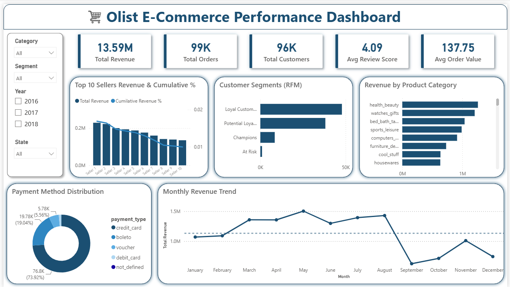

# 🛒 E-Commerce Sales Analytics Dashboard

An end-to-end Data Analytics project that answers real business questions on the Olist Brazilian E-Commerce dataset (100k+ orders) using **Python, SQL, and Power BI** — covering the full workflow of a data analyst on the job, from raw data to a stakeholder-ready dashboard.

📊 **[View the interactive Power BI dashboard (.pbix)](https://drive.google.com/file/d/18cD4p_jECNLJPrRv8ISeaKCu5oK_7Sis/view?usp=sharing)** — hosted on Drive (file too large for GitHub); screenshot preview below.

---

## 📌 Project Overview

The goal was to simulate a real analytics engagement: start from messy, relational, real-world e-commerce data and produce business insights an actual stakeholder could act on — not just charts, but answers to specific business questions, backed by a full Python → SQL → Power BI pipeline.

---

## 🛠️ Technologies Used

* **Python** — Pandas, NumPy, Matplotlib (cleaning, feature engineering, EDA)
* **SQL** — MySQL (business queries, JOINs, window functions, RFM segmentation)
* **Power BI** — interactive dashboard
* **Jupyter Notebook**

---

## 🧠 Skills Demonstrated

* Data Cleaning & Preprocessing (handling nulls, type conversions across 9 relational tables)
* Feature Engineering (delivery time, delivery delay, approval time)
* Exploratory Data Analysis & Visualization
* SQL — JOINs, CASE, window functions (`NTILE`), RFM segmentation
* Business Problem Framing (translating raw data into stakeholder-relevant questions)
* Dashboard Design & Storytelling (Power BI)
* Debugging real data/import errors (see below)

---

## 📈 Business Questions Answered

| # | Question | Key Finding |
|---|---|---|
| 1 | Revenue & Category Performance | Identified top revenue-driving categories |
| 2 | Customer Purchase Behavior | **96.9%** of customers never placed a second order |
| 3 | Delivery Performance & Satisfaction | Delivery delay correlates with lower review scores |
| 4 | Payment Behavior | Mapped payment method preference across order values |
| 5 | Seller Performance & Marketplace Health | **Top 10% of sellers generate ~67%** of total revenue |
| 6 | RFM Customer Segmentation | Segmented customers into value/risk tiers using SQL window functions |

---

## ⚙️ Project Workflow

1. **Business Understanding** — defined 6 core questions before writing any code
2. **Python** — loaded, cleaned, and feature-engineered raw data (`notebooks/`)
3. **SQL** — rebuilt a clean MySQL database from Python-cleaned data, wrote business queries (`sql/`)
4. **Power BI** — built a consolidated dashboard answering all 6 questions
5. **Documentation** — this README + full write-up in `reports/`

---

## 📂 Project Structure

```
Ecommerce-Sales-Analytics/
│
├── data/                # Cleaned datasets (geolocation table sampled for size)
├── notebooks/           # Python: loading, cleaning, feature engineering, EDA
├── sql/                 # Business queries + database schema
├── images/              # Dashboard screenshot
├── reports/             # Full written project report (PDF)
└── README.md
```

*Raw data not included (large files) — original source: [Olist Brazilian E-Commerce Public Dataset, Kaggle](https://www.kaggle.com/datasets/olistbr/brazilian-ecommerce)*

### Dashboard Preview


---

## 🚀 How to Explore This Project

1. Clone this repository
   ```bash
   git clone <repository-link>
   ```
2. Explore the Python pipeline
   ```bash
   cd notebooks
   jupyter notebook
   ```
3. Review the SQL business queries in `sql/business_analysis.sql`
4. Open the full interactive dashboard via the Drive link above

---

## 🐛 Real Data Challenges Solved

Working with genuinely messy, real-world data (not a pre-cleaned tutorial dataset) surfaced practical engineering problems:

* **MySQL import failure on NaN values** — an `approval_time_hours` column caused truncation errors during load; traced to how missing values get written to CSV, resolved with a SQL mode adjustment
* **Duplicate primary keys** — the raw `order_reviews` table had duplicate `review_id` values (a known dataset quirk), handled explicitly during load rather than ignored
* **Meaningful nulls preserved, not dropped** — missing delivery dates signal orders that were never delivered (a real business condition); 610 products with missing categories were labeled "unknown" and kept, since they represented real revenue

---

## 📈 Future Improvements

* Add cohort retention analysis to dig deeper into the 96.9% one-time-buyer finding
* Automate the Python → SQL pipeline with a scheduled script
* Deploy summary insights as a lightweight web dashboard (Streamlit)
* Expand seller performance analysis with a churn-risk indicator

---

## 👨‍💻 Author

**Arjun**
Data Science Student | Aspiring Data Analyst

If you found this project useful, feel free to ⭐ the repository.
